<div align="center">
  

  # NIGHTWATCH3R

  **Zero-Trust Execution Rail & Algorithmic PolicyGate for Quantitative Finance**

  [](https://workers.cloudflare.com/)
  [](https://www.typescriptlang.org/)
  [](https://alpaca.markets/)
</div>

---

## Executive Summary

Most algorithmic trading bots are highly vulnerable single-points of failure. They trust every signal they generate and execute them blindly. 

**NIGHTWATCH3R** flips this architecture. Built entirely on **Cloudflare Workers** and **Durable Objects**, it is a deterministic, idempotent, policy-gated execution rail with cryptographic trade provenance. 

> *No signal reaches the execution broker (Alpaca) without passing a verifiable trust chain.*

It is designed to bridge the gap between heavy quantitative research (e.g., Quant Code Automata) and live market execution, operating with zero marginal cost per trade.

---

## Architectural Moat

### 1. The PolicyGate (Armor)
Before any order is sent to the execution engine, it must pass a multi-factor risk assessment:
*   **Kelly Criterion Sizing:** Dynamically scales position size based on edge edge and bankroll.
*   **Value at Risk (VaR):** Real-time portfolio risk assessment.
*   **Regime Detection:** Adjusts logic based on current market volatility and trend.

### 2. Cryptographic Trade Provenance
Every approved signal generates an HMAC-signed approval token. The execution engine rejects any order request that cannot cryptographically prove it was validated by the PolicyGate.

### 3. Alpha Socket (Signal Aggregation)
A unified ingestion API capable of aggregating signals from external ML pipelines, webhook alerts, and local backtests, validating their structure before processing.

---

## The "Live Demo" Setup (3 Steps)

1. **Clone & Configure**
   ```bash
   git clone https://github.com/LNSTT369/NIGHTWATCH3R.git
   cd NIGHTWATCH3R
   cp .dev.vars.example .dev.vars # Add your Alpaca keys
   ```

2. **Seed & Launch**
   ```bash
   ./scripts/start.sh
   ```
   *(This script auto-migrates your local D1 database, seeds a development API key, and boots the Cloudflare Worker.)*

3. **Deploy a Signal**
   Use the `portfolio-deploy` tool or the Alpha Portal UI to inject a signal. Watch the PolicyGate approve the order, the equity curve update, and the paper trade hit Alpaca.

---

## Tech Stack
*   **Compute:** Cloudflare Workers (TypeScript)
*   **State:** Cloudflare D1 (SQL), KV, and Durable Objects
*   **Execution:** Alpaca Markets API
*   **AI Integration:** Model Context Protocol (MCP) server for Claude/Cursor

<div align="center">
  <i>"The goal isn't a system. The goal is a reputation you build once and leverage forever."</i>
</div>
