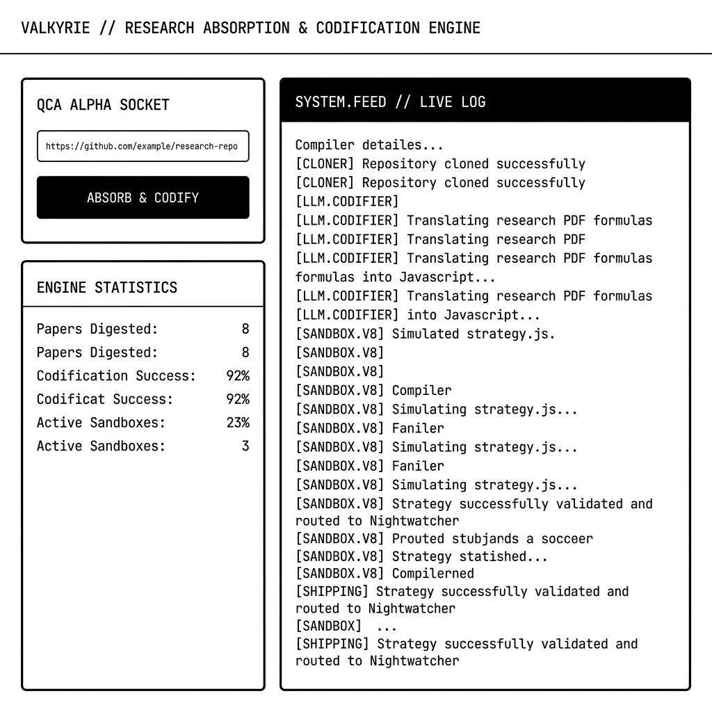

<div align="center">
  

  # VALKYRIE

  **Zero-Trust Execution Rail & Algorithmic PolicyGate for Quantitative Finance.**

  [](https://workers.cloudflare.com/)
  [](https://www.typescriptlang.org/)
  [](https://alpaca.markets/)
</div>

---

## What This Actually Is

Most trading bots are trust-fund software: they generate signals, assume the signals are right, and wire them straight to an exchange. One hallucination, one regime shift, one dead API call — and you're holding a bag of losses with no audit trail.

**VALKYRIE inverts that stack.** Every trade signal must pass through a deterministic, cryptographic PolicyGate before it ever touches Alpaca. No signal reaches the execution broker without a verifiable trust chain. HMAC-signed approval tokens. Real-time position sizing via Kelly Criterion. Volatility-aware regime detection. If the policy rejects it, the order never ships. That's the whole point.

> *Built on Cloudflare Workers. Secured by Durable Objects. Executed through Alpaca.*
> *Zero marginal cost per trade. Zero blind trust, either.*

## Interface Preview

<p align="center">
  
</p>

---

## Quick Start — 3 Steps, Paper Trading

```bash
git clone https://github.com/LNSTT369/VALKYRIE.git
cd VALKYRIE

./start.sh
# → Auto-installs dependencies (if missing)
# → Provisions a local D1 SQLite database with migrations
# → Boots wrangler on port 8787
```

That's the entire setup. The boot banner shows you every endpoint. No config file? You get a banner, not a crash.

Then open: **http://localhost:8787/portal**

Follow the multi-step onboarding flow: accept the risk disclaimer → enter your Developer Key → plug in your Alpaca paper-trading credentials (API Key, Secret, starting equity) → you're live.

Inject a signal through the Alpha Portal UI or via MCP tools. Watch the PolicyGate approve it. Watch the equity curve update. Watch the paper order hit Alpaca's sandbox. Done.

---

## Architecture at a Glance

```
RESEARCH ──▶ ALPHA SOCKET ──▶ POLICYGATE ──▶ ALPACA
    │              │                  │                │
    │         Signals          Risk & Regime         Market Fill
    │        Ingestion           Filter            HMAC-Verified
```

Every component is a Durable Object. Every signal is signed. Every trade is reconcilable.

### PolicyGate (The Moat)

Pre-execution risk filter that runs on every single order:

| Check | What It Does | Fail Condition |
|---|---|---|
| **Kelly Criterion** | Dynamically scales position size based on calculated edge | Bankroll or edge below threshold |
| **Value at Risk** | Monte Carlo portfolio exposure modeling | Portfolio VaR exceeds config limit |
| **Regime Detection** | Classifies current volatility regime, adjusts sizing | High-vol mode caps all new positions |
| **Position Limits** | Hard cap on open positions and notional per trade | Hits max open or daily loss % |

All configuration is overridable via D1 — the defaults in `wrangler.toml` are sane starting points.

### Alpha Socket (Signal Ingestion)

A unified ingestion API that accepts signals from any source: MCP agent, webhook alert, backtest pipeline, or GitHub repo deploy. Validates structure before processing. Cryptographic HMAC signing for all inter-component comms.

### Reconciler (Audit Trail)

A 60-second cron-driven Durable Object that aligns broker state with internal state. Checks Alpaca's position data against what VALKYRIE thinks is open. Logs discrepancies. Acts as the single source of truth for any trade audit.

---

## The Onboarding Flow

The Alpha Portal walks you through setup in four steps:

1. **Intro** — What this is, how it works, why it exists. Two screens max.
2. **Risk Disclaimer** — Mandatory acceptance before any configuration.
3. **Developer Key** — Authenticate your tenancy with a cryptographic key.
4. **Alpaca Setup** — API Keys, Paper Trading toggle, Starting Equity.

No form is submitted without validation. No key is accepted without format check. The portal itself runs as static assets served from the same Cloudflare Workers runtime.

---

## Endpoints

| Endpoint | Method | Purpose |
|---|---|---|
| `/health` | GET | Health check, returns environment & timestamp |
| `/` | GET | Root — service manifest with all known endpoints |
| `/portal` | GET | Alpha Portal dashboard (static assets) |
| `/api/signal` | POST | Submit a trade signal for policy review |
| `/api/signal` | GET | List recent signals and their status |
| `/api/signal/deploy` | POST | Deploy a strategy from a GitHub repo URL |
| `/alpha-socket/repo` | POST | Ingest strategy via the Alpha Socket |
| `/alpha-socket/repo/status` | GET | Check deployment status |
| `/alpha-socket/repo/history` | GET | Deployment history for your tenancy |
| `/api/v3/regime` | GET | Current volatility regime detection |
| `/api/v3/risk` | POST | Query policy risk configuration |
| `/api/v3/signals` | GET | Live signals from active strategies |
| `/api/v3/config` | GET | Runtime policy configuration |
| `/api/v3/status` | GET | Execution rail status & health |
| `/api/v3/strategies` | GET | List deployed strategies on this tenancy |
| `/mcp` | POST | MCP agent endpoint (Durable Object) |

Run `http://localhost:8787/` in your browser to see the full service manifest.

---

## Tech Stack

| Layer | Technology | Why |
|---|---|---|
| **Compute** | Cloudflare Workers | Zero cold-start, global edge, $0 marginal compute cost |
| **State** | D1 + KV + DO | Deterministic state machine per tenancy |
| **Database** | Cloudflare D1 (SQLite) | SQL on the edge. Local mode for dev, D1 for prod |
| **Execution** | Alpaca Markets API | Paper trading in dev, live equity in prod |
| **AI/ML** | MCP Server | Claude/Cursor integration, multi-provider cascade (OpenAI → Gemini → Ollama) |
| **Streaming** | WebSocket | Live equity curve, real-time signal updates |

---

## Local-First Development

This project is designed for self-hosting. You don't need a Cloudflare account to run it locally:

```bash
./start.sh          # Auto-installs deps, provisions local D1, boots dev server
```

The `start.sh` script handles:

- **Node.js version check** (requires >= 18)
- **Auto `npm install`** if `node_modules` is missing
- **.dev.vars warning banner** with clear instructions if config is empty
- **Local D1 provisioning** via SQLite — no Cloudflare API needed
- **Migration execution** from `0001_initial.sql` in the migrations directory
- **Boot banner** showing all endpoints and their purposes

When you deploy to production (`npm run deploy`), it hits real Cloudflare Workers with a real D1 database. But dev runs entirely local-first. That's the design: self-host, test, verify before you touch live capital.

---

## Philosophy

```
  "Most systems are designed for the happy path.
   This one is not."
```

The architecture assumes every signal could be wrong. Every API call could fail. Every trade could be reversed. The PolicyGate exists because the happy path is a liability, not a feature.

> *No signal reaches the execution broker without a verifiable trust chain.*
> *Zero marginal cost per trade. Zero blind trust.*

---

## Project Links

| Resource | Purpose |
|---|---|
| [Cloudflare Workers](https://workers.cloudflare.com/) | Runtime platform |
| [Alpaca Markets](https://alpaca.markets/) | Execution broker |
| [MCP Specification](https://modelcontextprotocol.io) | Agent protocol standard |

---

<div align="center">
  <i>"The goal isn't a system. The goal is a reputation you build once and leverage forever."</i>
</div>
